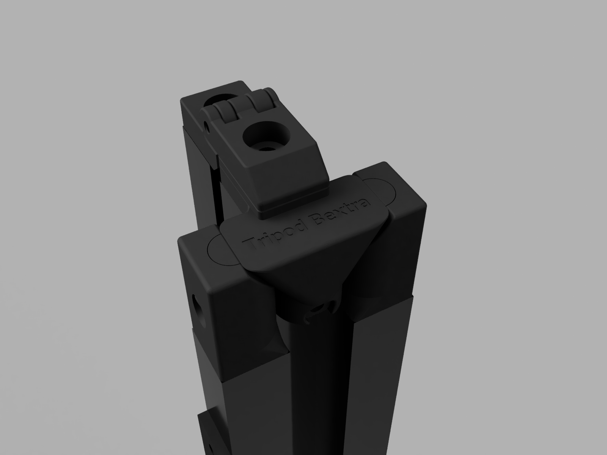
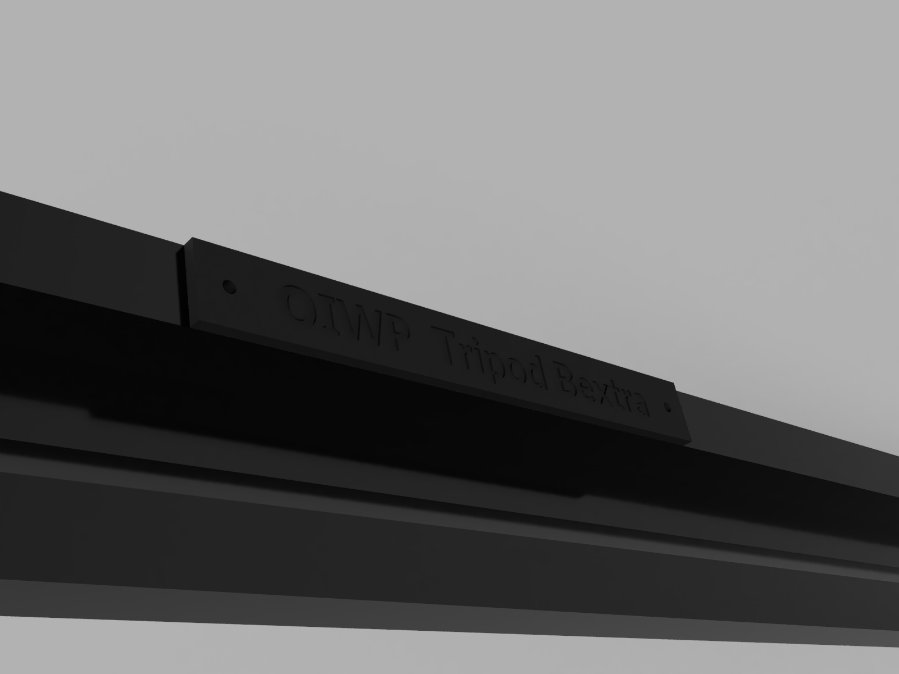
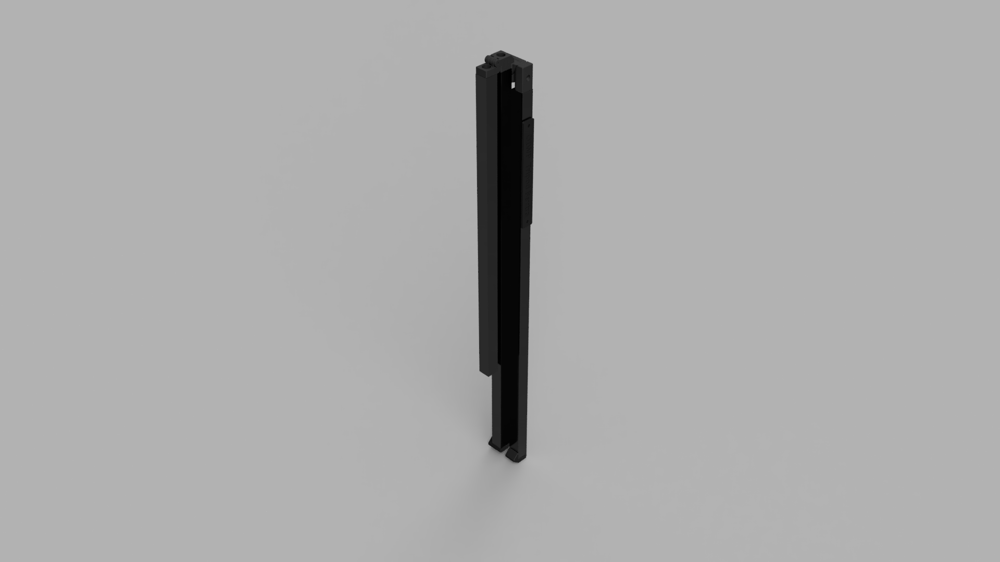
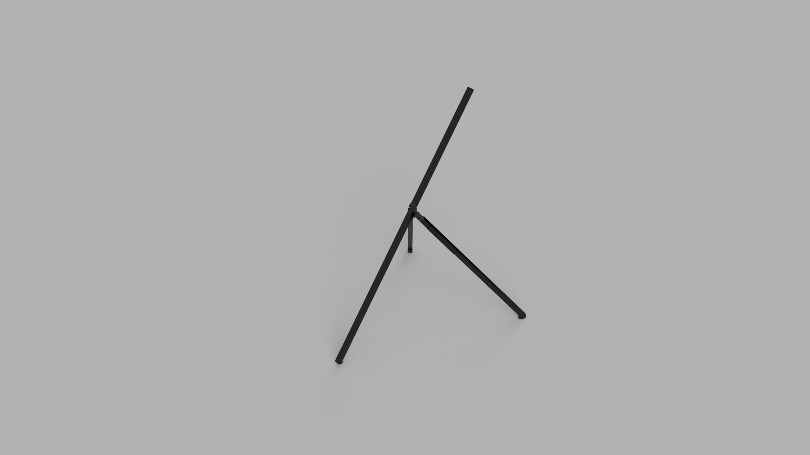

# TripodBextra
TripodBextra is an experimential tripod that is intended to look completely different.

## Variants
This project consists short-necked and long-necked versions. The long-necked version was introduced just for expectation.

## Project goal
This project has multiple goals, including:
* Intended to look different,
* Simple to setup,
* Uses standard camera tripod screw mount.

## BOM

This design only requires 3x 1000mm 3030 extrusions, 1x 3030 T-nut, 4x M8x10mm, 2xM5x35mm, 1xM6x30 and 1xM8x20mm.
For the long-neck version, an additional 750mm 3030 extrusion and a M8x10 are required, besides above.